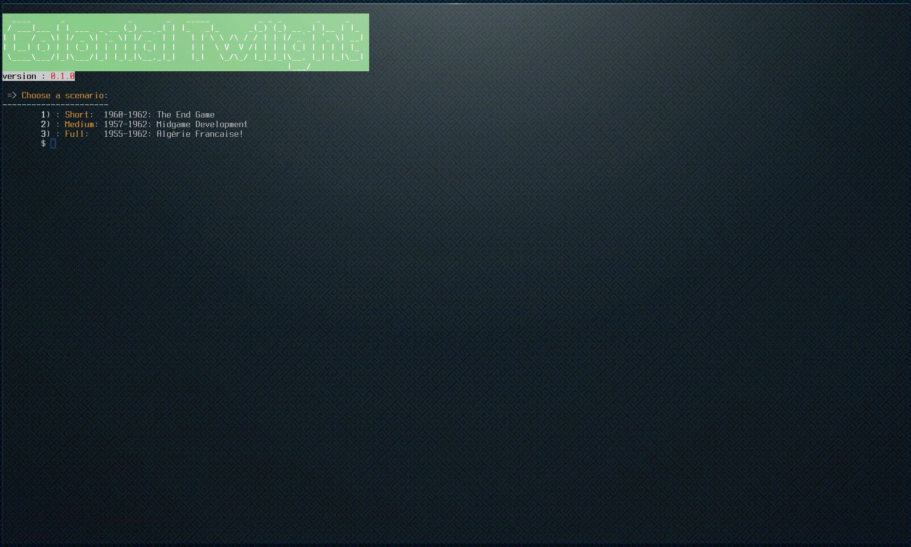

# ColonialTwilight

I played many solo games of GMT's [Labyrinth](https://www.gmtgames.com/p-720-labyrinth-4th-printing.aspx)
using [awakening](https://github.com/sellmerfud/awakening), a scala implementation of both the Jihadist and the USA bots.

The only bad point I see in that console application is the poor readability of the output.

So there it is, my proof of concept, a quick and dirty ruby implementation of the FLN bot of GMT's [Colonial Twilight](https://www.gmtgames.com/p-548-colonial-twilight-the-french-algerian-war-1954-62.aspx), with a nice and colorful output and place to implement a GUI, once maybe.

CLI behaviour is copied on [coltwi](https://github.com/sellmerfud/coltwi).

## CLI demo

